# musync

**Projeto:** musync  
**Autor:** Jhonatan | Nathan  
**GitHub:** [https://github.com/Ntzzn-Dev](https://github.com/Ntzzn-Dev)  
**Data:** 05/07/2025  

  
   

## Descrição  

Um aplicativo mobile com capacidade de organizar musicas locais, reproduzi-las, baixar e transferir as musicas entre plataformas.   

## Demonstração  

## Android

### Tela Principal  
Tela onde ficam todas as músicas encontradas.  
O player abaixo se possui os botões principais para controle da mídia.  
<p float="left">
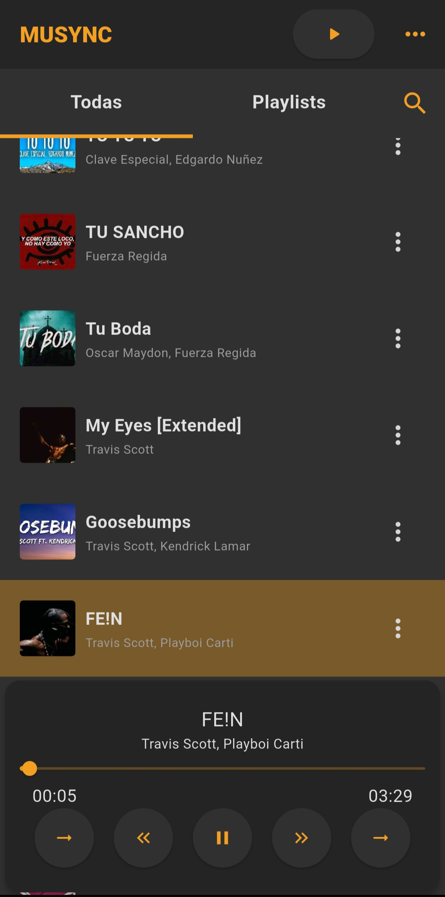
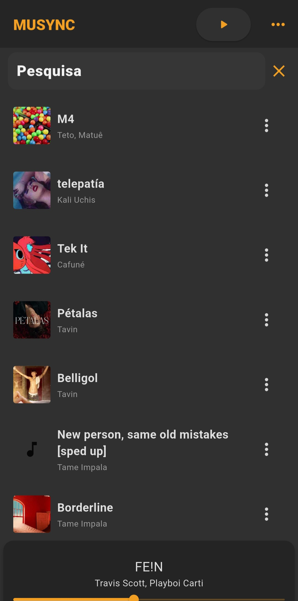  
</p>

### Configurações e Downloads  
Na tela de configurações são definidos:  
- os diretórios onde as músicas são baixadas pelo downloader.  
- a playlist padrão que a tela de downloads carrega.  
- os diretórios onde são buscadas as mídias.  

Na tela de donwload, a playlist padrão é carregada permitindo a seleção de uma ou mais mídias para download.  
O download é feito através de vídeos do youtube.  
<p float="left">
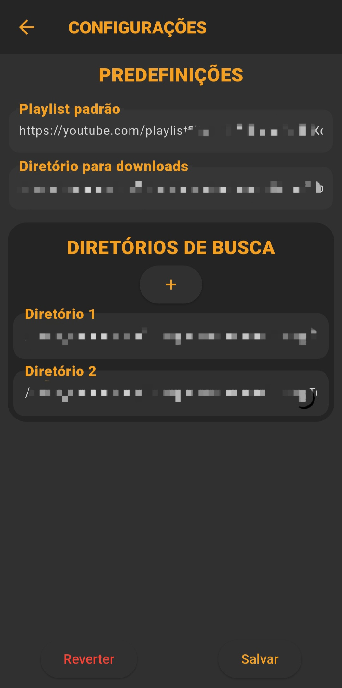
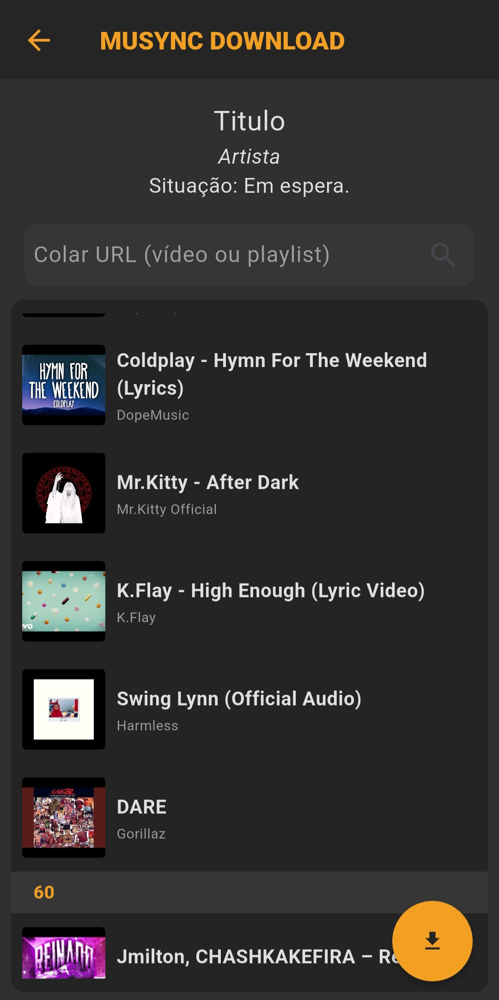  
</p>

### Informações e Opções de Música  
<p float="left">
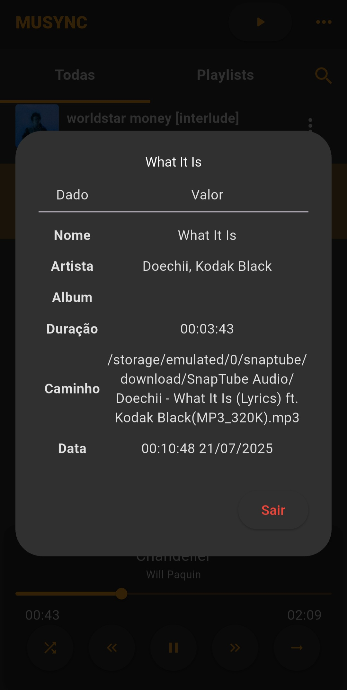
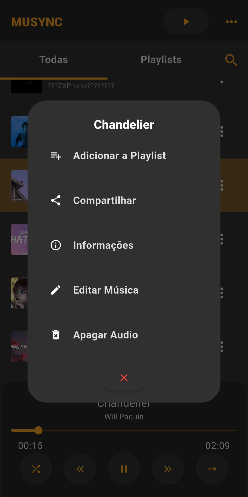  
</p>

### Playlists  
Página que controla as playlists, criadas pelo usuário ou as separadas por artista.  
<p float="left">
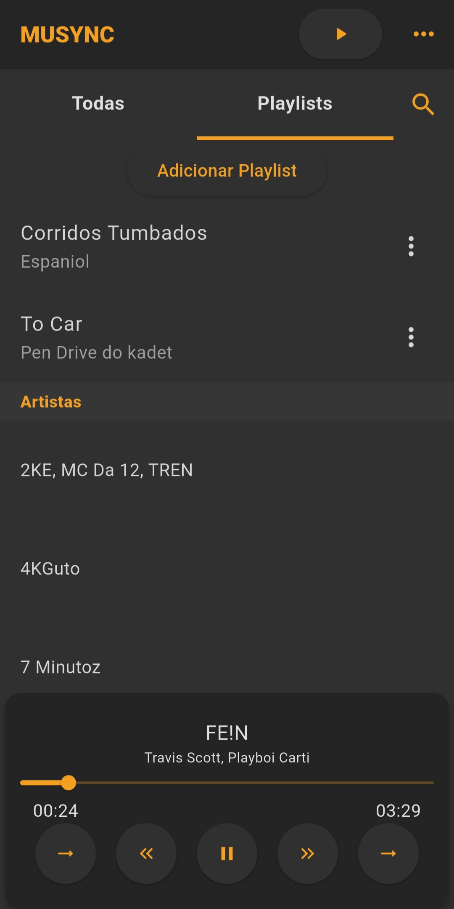
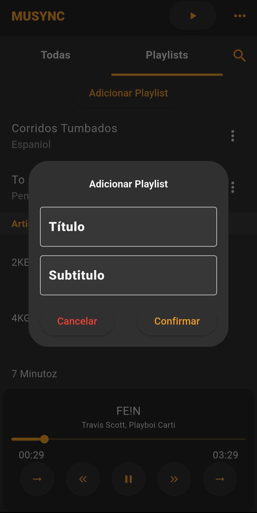  
</p>

### Player da Notificação 
Na notificação estão as ações mais importantes, incluindo controle de aleatório.   

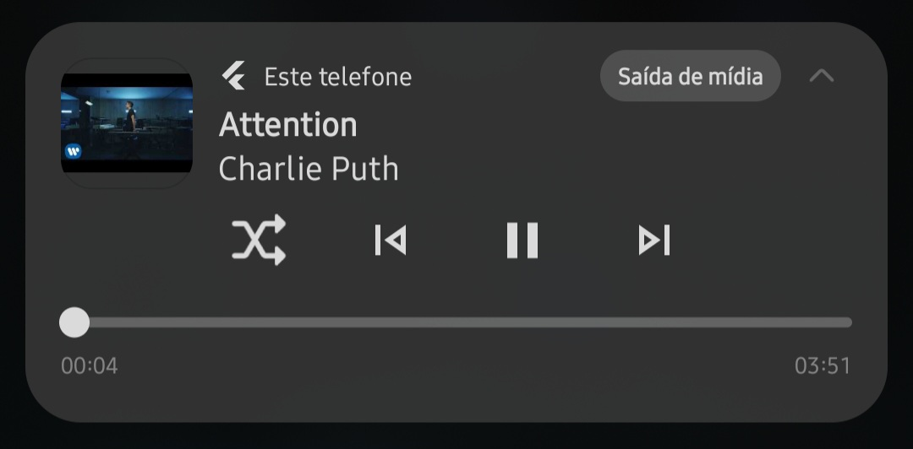  

## Desktop  
Para conectar, primeiramente é necessário digitar manualmente o IP local do desktop nas configurações do mobile.  
### Conexão
Ao começar uma conexão, automáticamente toda a lista de músicas que estão sendo reproduzidas atualmente serão enviadas para o desktop em partes quebradas e reconstruidas localmente. Tudo isso enquanto outras músicas, já carregadas, podem ser reproduzidas.  
Durante a conexão, a versão mobile se apropria de um player avermelhado, que serve de indicação de conexão efetuada.  

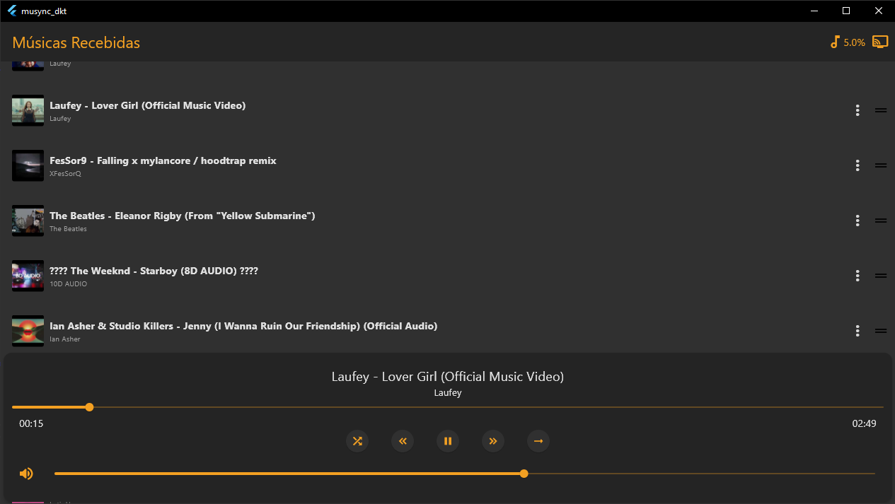  

### Recepção  
Conforme as músicas forem sendo carregadas um contador exibirá sua porcentagem e/ou razão precisa no canto superior direito.   
É possível controlar a música atual, volume e posição atual, através do smartphone e do desktop, por meio de conversas rápidas WebSocket.  

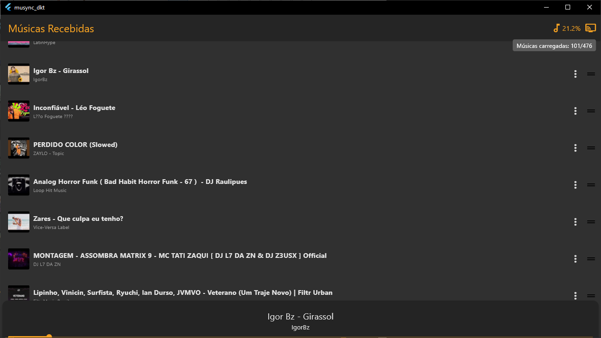  

### Desconexão  
É possível desconectar de ambos os lados, tanto clicando no ícone de conexão e desconectando manualmente, ou simplesmente fechando um dos dois.  
<p float="left">
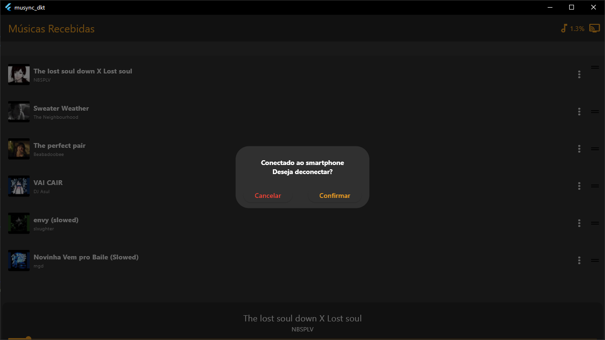
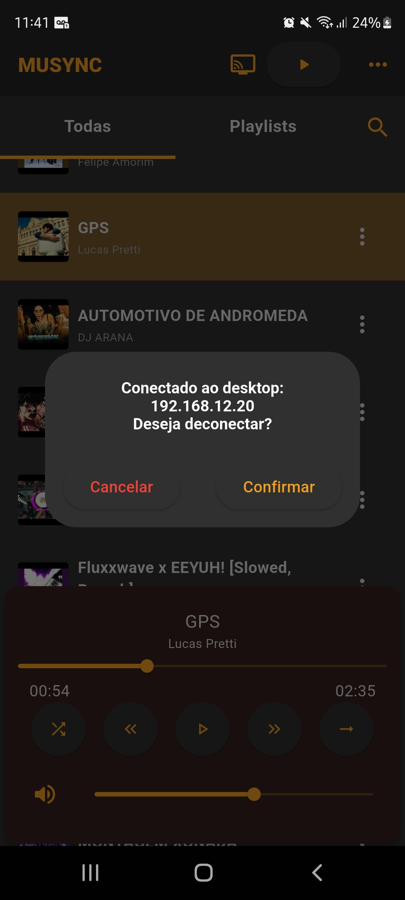  
</p>

## Utilização  
1. Clone este repositório:  
  ```git clone https://github.com/Ntzzn-Dev/Musync.git```  
2. Entre na pasta e rode (para android):  
  ```cd musync_and```  
  ```flutter pub get```  
  ```flutter run``` 
3. Entre na pasta e rode (para desktop):  
  ```cd musync_dkt```  
  ```flutter pub get```  
  ```flutter run```  

## Tecnologias  
- Flutter (Dart)  
- SQLite (armazenamento local)  
- WebSocket (conexão via wi-fi local)

## Contribuição
Sinta-se à vontade para abrir issues ou sugerir melhorias!  

## Log de versões
- **v1.0** → Versão inicial, player básico.
- **v2.0** → Download de músicas via YouTube.
- **v3.0** → Configurações avançadas, playlists e melhorias no modo aleatório.
- **v4.0** → Integração do desktop, e configuração para que o android aja como um controle remoto.
- **v5.0** → Tela de Controle Aprimorado, possui apenas botões essenciais e grandes.  

Veja o changelog completo em [CHANGELOG.md](CHANGELOG.md)